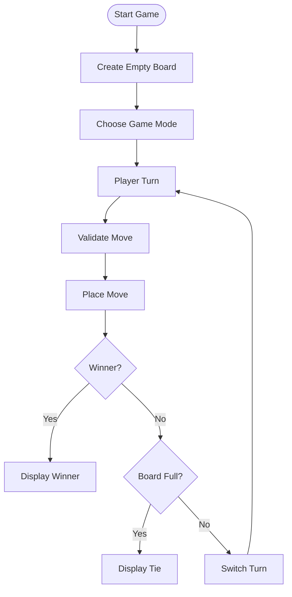

# 🎮 Tic Tac Toe – Python Project

<p align="center">
  <b>Interactive Tic Tac Toe game developed in Python with support for multiplayer mode and AI bot gameplay.</b>
</p>

---

## ✨ Project Presentation

This project is a complete implementation of the classic **Tic Tac Toe** game using Python.

The objective of the project is to apply fundamental programming concepts through the creation of an interactive game playable directly in the terminal.

The game supports:
- 👥 **Two-player mode**
- 🤖 **Player vs Bot mode**

The project also includes:
- Unit tests
- Input validation
- Game state management
- Simple AI decision-making

---

# 🧠 Educational Objectives

This project was designed to practice and strengthen understanding of:

- Functions and modular programming
- Loops and conditional statements
- 2D arrays (lists of lists)
- User input handling
- Algorithmic thinking
- Testing and debugging
- Basic Artificial Intelligence logic

---

# 🚀 Features

✔️ Interactive terminal interface  
✔️ Two-player gameplay  
✔️ AI bot opponent  
✔️ Move validation system  
✔️ Winner detection  
✔️ Draw detection  
✔️ Unit testing support  
✔️ Clean and modular code architecture  

---

# 📁 Project Structure

```bash
tictactoe/
│
├── game.py               # Main game logic
├── bot.py                # Bot AI logic
├── ttt_functions.py      # Core Tic Tac Toe functions
├── ttt_unit_tests.py     # Unit tests
├── requirements.txt
├── .gitignore
└── README.md
```

---

# 🔁 Game Flow



---

# 🔍 Main Files Description

## 🟦 `game.py`

This file manages:
- the main game loop
- board display
- player turns
- move handling
- win and draw detection

---

## 🟦 `bot.py`

Contains the artificial intelligence logic used when playing against the computer.

The bot follows a simple strategy:
1. Try to win
2. Block opponent winning moves
3. Build future winning opportunities
4. Choose a random valid move

---

## 🟦 `ttt_functions.py`

Contains the core functions of the game:

| Function | Description |
|----------|-------------|
| `is_valid_move()` | Checks if a move is valid |
| `place_move()` | Places a move on the board |
| `check_winner()` | Detects a winner |
| `is_board_full()` | Detects if the board is full |

---

## 🟦 `ttt_unit_tests.py`

Contains automated tests used to verify:
- move validation
- move placement
- winner detection
- board completion detection

---

# ▶️ How to Run the Project

## 1️⃣ Clone the repository

```bash
git clone https://github.com/your-username/tictactoe.git
```

---

## 2️⃣ Open the project folder

```bash
cd tictactoe
```

---

## 3️⃣ Run the game

```bash
python game.py
```

---

# 🧪 Run Unit Tests

```bash
python ttt_unit_tests.py
```

---

# 🎮 Example Gameplay

```text
   1   2   3
A  X | O | X
  ---+---+---
B  O | X |  
  ---+---+---
C    |   | X

Player X wins!
```

---

# 💡 Possible Improvements

- Add graphical interface with Tkinter 🎨
- Implement Minimax AI 🤖
- Add score tracking 📊
- Add online multiplayer 🌐

---

# 🧠 Skills Developed

Through this project, the following skills were reinforced:

- Python programming
- Problem solving
- Code organization
- Testing and debugging
- Algorithmic reasoning

---

# 👨‍💻 Author

Myriam Trabelsi

---

# ⭐ Conclusion

This project demonstrates how fundamental programming concepts can be combined to create a complete interactive application.

It also highlights the importance of:
- modular programming
- testing
- clean code structure
- logical problem solving

---

💬 *“The best way to learn programming is by building real projects.”*